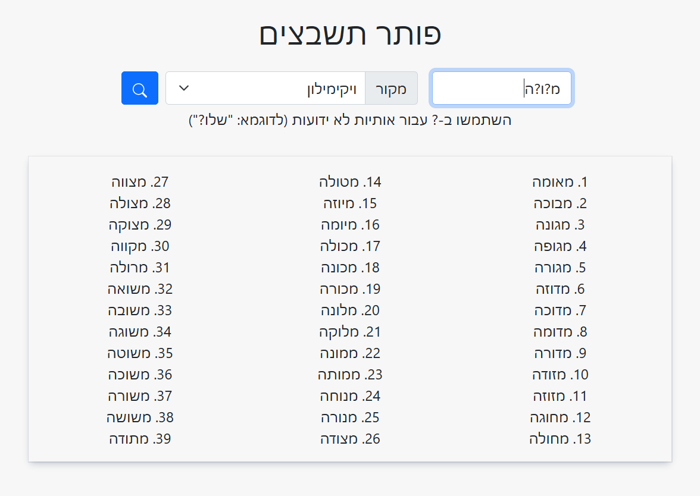

# Crossword Solver (פותר תשבצים)

**Crossword Solver** is a utility which can be used in order to find (Hebrew) words when some of the letters are unknown, for example while solving a crossword puzzle. 

Using this application is as simple as entering the known letters, while substituting the unknown letters with question marks. The application will display a list of all known words which match the provided template.

The application is available online [here](https://dvd848.github.io/Crossword-Solver/).

## Similar Tools

 * Snopi: [חיפוש מילה לתשבצים וורדעל](http://www.snopi.com/xDic/CrossWordDic.aspx)
 * Israwords: [ישראוורדס עזרה בתשחץ ותשבץ](https://www.israwords.co.il/%D7%A4%D7%95%D7%AA%D7%A8-%D7%94%D7%AA%D7%A9%D7%91%D7%A6%D7%99%D7%9D)
 * Zolo: [מנוע פתרון תשבצים למקצוענים](https://www.zolo.co.il/calc/puzzle_new/)

## License

Crossword Solver is released under [AGPLv3](https://www.gnu.org/licenses/agpl-3.0.en.html).

Crossword Solver utilizes several open dictionaries as part of its functionality:
 * [Wiktionary](https://he.wiktionary.org/wiki/%D7%95%D7%99%D7%A7%D7%99%D7%9E%D7%99%D7%9C%D7%95%D7%9F:%D7%A2%D7%9E%D7%95%D7%93_%D7%A8%D7%90%D7%A9%D7%99) - Released under [CC-BY-SA 3.0](https://creativecommons.org/licenses/by-sa/3.0/)
 * [Hspell](http://hspell.ivrix.org.il/) Dictionary - Released under [AGPLv3](https://www.gnu.org/licenses/agpl-3.0.en.html)